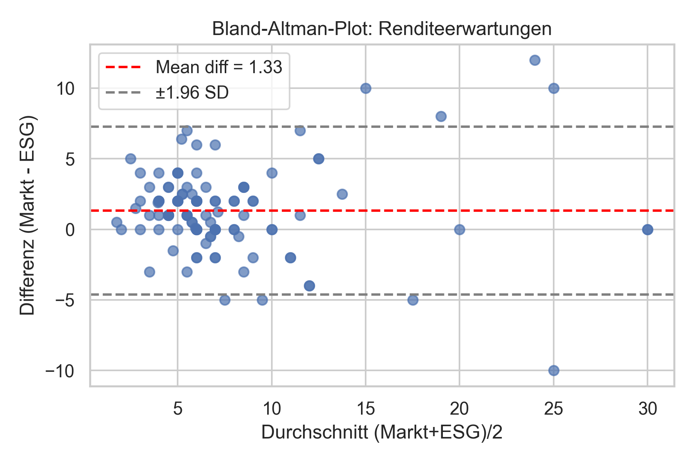
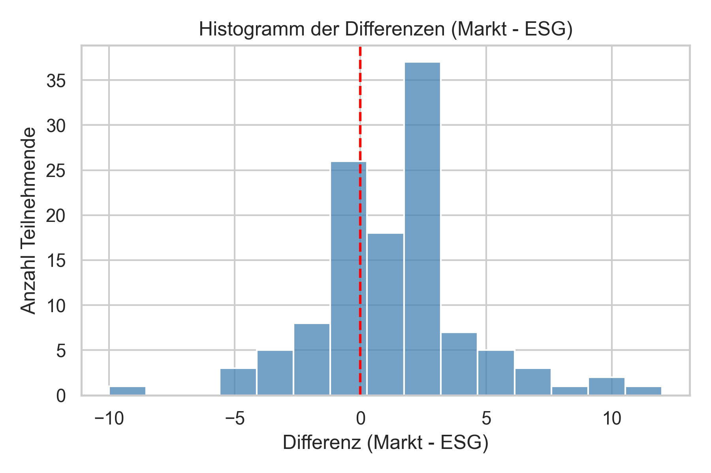
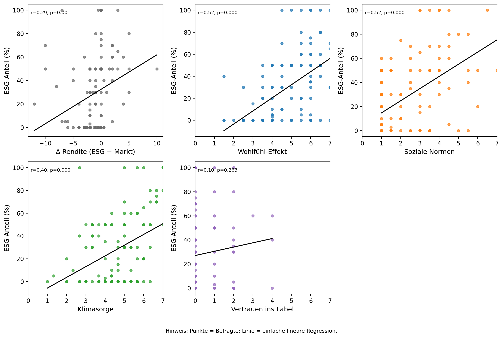
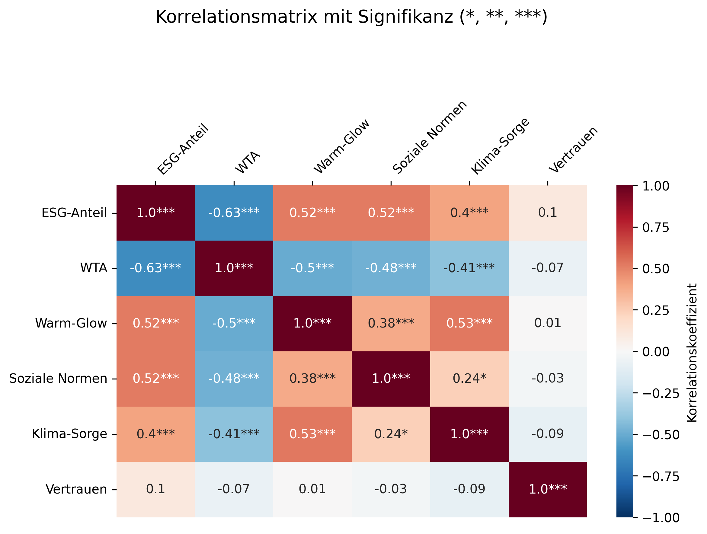

# ESG and Investor Return Trade-Off Analysis

## Project Overview

This project analyzes how much financial return private investors are willing to sacrifice in exchange for investments aligned with Environmental, Social, and Governance (ESG) principles.

The analysis investigates the relationship between sustainability preferences, financial knowledge, risk tolerance, and expected investment returns.

A structured statistical pipeline was implemented to analyze survey data and evaluate investor behavior toward sustainable finance.

---

## Research Question

How much financial return are private investors willing to give up for investments in companies with stronger ESG performance?

---

## Methodology

The project follows a step-based analytical workflow:

1. **Demographic Analysis**

   * Age distribution
   * Gender distribution
   * Investment experience

2. **Financial Knowledge Analysis**

   * Investor understanding of financial markets
   * ESG awareness and familiarity

3. **Return Expectation Analysis**

   * Distribution of expected investment returns
   * Differences between investor groups

4. **Willingness-to-Accept (WTA) Return Reduction**

   * Measuring how much return investors are willing to sacrifice for ESG investments

5. **ESG Label Perception**

   * Analysis of trust in sustainability certifications such as the FNG seal

6. **Portfolio Allocation**

   * Analysis of ESG vs non-ESG asset allocation

7. **Psychological Scale Reliability**

   * Reliability analysis using Cronbach’s alpha

8. **Risk Preference Analysis**

   * Risk tolerance and investment behavior

9. **Hypothesis Testing**

   * Statistical testing of ESG investment behavior hypotheses

---

## Statistical Methods Used

* Data Cleaning and Preprocessing
* Exploratory Data Analysis (EDA)
* Linear Regression Analysis
* Independent Sample T-Test
* Reliability Analysis (Cronbach’s Alpha)
* Data Visualization

---

## Tools and Technologies

Python
Pandas
NumPy
Statsmodels
Matplotlib
Excel

---

## Key Visualizations

Example visualizations generated during the analysis:









Additional figures generated during the analysis are available in the `images` directory.

---

## Key Findings

* Investors demonstrate measurable willingness to sacrifice financial returns for ESG-aligned investments.
* ESG certification labels influence investor trust and decision-making.
* Investors with higher sustainability awareness allocate a larger portion of their portfolios to ESG investments.
* Risk tolerance and financial literacy influence ESG investment preferences.

---

## Repository Structure

```
ESG-Investor-Return-Analysis
│
├── README.md
│
├── images
│   ├── fig_age_pyramid.png
│   ├── fig_returns_density.png
│   ├── regression_plot.png
│
├── results
│   └── ESG_Investor_Return_Analysis_Results.xlsx
│
└── report
    └── ESG_Investor_Return_Tradeoff_Report.pdf
```

## Notes

The analysis pipeline was implemented using Python.
Due to academic collaboration restrictions, the full source code is maintained in a private repository.
